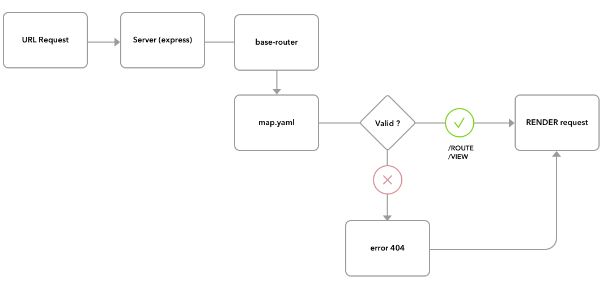

# @e-xisto/base-router

Base-router es el enrutador personalizado que utilizamos por defecto en nuestra esctructura de [proyecto BASE](https://github.com/e-xisto/base). Mediante la carga de un archivo de configuración tipo YAML (o JSON opcionalmente) definimos la arquitectura de contenidos y enrutado de nuestro website.


### Esquema de funcionamiento




base-router actuará como middleware recibiendo todas las peticiones URL que llegan a nuestro servidor express. Para cada petición realizará una consulta a nuestro mapa de configuración (`map.yaml`) para comprobar si la URL recibida está definida o no en él. Si la URL está definida en nuestro mapa le pedirá a express que se encargue de renderizar la respuesta indicándole que configuración de router y vista debe utilizar. Si la ruta no existe en el mapa express devolverá como respuesta un error.


### Instalación

El primer paso consiste en instalar el paquete dentro de nuestro proyecto:

```bash
npm install @e-xisto/base-router
```


### Configuración

En el archivo de configuración de nuestra aplicación express incluiremos:

```javascript
const baseRouter = require ('@e-xisto/base-router');

// Configurar e iniciar nuestro router
baseRouter.configure ({ path: __dirname, map: 'map.yaml' });
```


Opciones de configuración:

| Variable          | Description                                                  |
| :---------------- | ------------------------------------------------------------ |
| **path**          | Ruta de la aplicación, esta variable es obligatoria e indica la ruta donde empezar a localizar el mapa y las rutas estáticas. |
| map               | Nombre del fichero del mapa. Debe estar localizado en el path o ser una ruta relativa al path. Por defecto tiene el valor `map.yaml` |
| pathRoutes        | Ruta de la la carpeta de rutas. Por defecto `[path]/routes`  |
| [routes](#routes) | Nombre del fichero de rutas. Por defecto `routes.js`         |

Un ejemplo de configuración básica para nuestra aplicación express sería:

```javascript
// Archivo /server.js

const express      = require ('express');
const http         = require('http');
const debug        = require('debug');
const path         = require ('path');
const cookieParser = require ('cookie-parser');
const bodyParser   = require ('body-parser');
const nunjucks     = require ('nunjucks');

// Requerimos nuestro enrutador
const baseRouter   = require ('@e-xisto/base-router');

// Iniciamos nuestra aplicación express
const app  = module.exports = express ();

// Capturamos el puerto por defecto o lo capturamos de la variable de entorno
const port = normalizePort (process.env.PORT || '3000');

// Seteamos una pariable con el puerto
app.set ('port', port);

// Congiguramos nuestro motor de plantillas
app.set('view engine', 'njk');
app.set('views', path.join(__dirname, 'views'));

nunjucks.configure('views', {
  autoescape: true,
  noCache: true,
  express   : app
});

// Parseamos las peticiones recibidas con un middleware
app.use(bodyParser.json());
app.use(bodyParser.urlencoded({ extended: false }));

// Parseamos los accesos a las cookies
app.use(cookieParser());

// Configuramos nuestra carpeta de contenido público
app.use(express.static(path.join(__dirname, 'public')));

// Configuramos nuestro router
baseRouter.configure ({ path: __dirname, map: app.__args.map });

// Cartura de errores 404
app.use(function(req, res, next) {
  var err = new Error('Not Found');
  err.status = 404;
  next(err);
});

// Función para normalizar el puerto
function normalizePort (val) {

    var port = parseInt (val, 10);

  if (isNaN (port)) return val;
  if (port >= 0) return port;
  return false;
}

// Event listener for HTTP server "error" event
function onError(error) {

    if (error.syscall !== 'listen') throw error;

    let bind = typeof port === 'string' ? 'Pipe ' + port : 'Port ' + port;

    // handle specific listen errors with friendly messages
    switch (error.code) {
        case 'EACCES':
            console.error(bind + ' requires elevated privileges');
            process.exit(1);
            break;
        case 'EADDRINUSE':
            console.error(bind + ' is already in use');
            process.exit(1);
            break;
        default:
            throw error;
    }
}

// Event listener for HTTP server "listening" event.
function onListening() {

    let addr = server.address();
    let bind = typeof addr === 'string' ? 'pipe ' + addr : 'port ' + addr.port;

    console.log ("\n\x1b[32mAplicación escuchando en el puerto " + addr.port + "\x1b[0m\n");

    debug('Listening on ' + bind);
}

```


# Routes

El trabajo de nuestro router no es otro que procesar las peticiones que recibe el servidor y elegir qué ruta o  `route` interna debe cargar según la configuración indicada en nuestro [mapa](#mapa).

Para que esto sea posible debemos definir nuestro mapa de rutas disponibles. Para ello definimos un archivo de rutas (por defecto `/routes/routes.js`) donde asociaremos las rutas disponibles y el script de enrutado que finalmente pasaremos a nuestro servidor para renderizar la petición.

Un ejemplo de nuestro archivo de rutas:

```javascript
// Archivo /routes/routes.js

// Requerimos nuestro aplicación servidor
var app = require ('../server');

// Carga de rutas
app.use ('/sitemap', require ('./sitemap'));
app.use ('/template', require ('./template'));
app.use ('/editor', require ('./editor'));
app.use ('/home', require ('./home'));
app.use ('/noticias', require ('./noticias'));
app.use ('/proyectos', require ('./proyectos'));

// En este caso no necesitamos vincular a una ruta
app.use (require ('./breadcrumb'));
```

En este ejemplo definimos una ruta `/template` que podremos incluir en nuestro [mapa](#mapa) y que asociamos a la carga de nuestro archivo de enrutado de express `/routes/template.js` .

Nuestro archivo de enrutado podría quedar de la siguiente forma:

```javascript
// Archivo /routes/template.js

const router = require ('express').Router ();

router.get ('/', function (req, res, next) {
	res.render (res.locals.__route.router.view);
});

module.exports = router;
```

La estructura de nuestros archivo de enrutado será siempre muy similar. Primero requerimos express y los módulos o complementos que necesitemos, definimos las variantes de respuesta de nuestro router y por último exportamos el router.

Podemos comprobar que hemos usado la variable local `res.locals.__route.router.view`

Esta variable nos devuelve el nombre de la vista que hemos configurado para la ruta en el mapa.

Nuestro enrutador expone 3 variables locales que podemos usar en la configuración del nuestro router y en la vista. Estas variables son `res.locals.__route`, `res.locals.__server` y  `res.locals.__groups`.

Para saber más sobre estas variables consultar la sección [Variables](#variables).

Un ejemplo de configuración de router más compleja podría ser el de unas noticias:

```javascript
const router = require ('express').Router ();
const api = require ('../src/services/api');

router.get ('/:id(\\d+)', function (req, res, next) {

	api.get('/noticias/' + req.params.id).then((response) => {
		res.render ('noticias-detalle', { noticia: response.data });
	}).catch( (e) => {
		console.log(e);
		next();
	});
});

router.get ('/', function (req, res, next) {

	api.get('/noticias').then((response) => {
		res.render (res.locals.__route.router.view, { noticias: response.data });
	}).catch( (e) => {
		console.log(e);
		next();
	});
});

module.exports = router;
```

En este ejemplo, hemos configurado 2 posibles respuestas en nuestro router. Según los parámetros que recibamos en nuestra petición ([Mirar guía routing express](http://expressjs.com/en/guide/routing.html)) configuramos la respuesta para mostrar un listado de noticias:

````javascript
router.get ('/', function (req, res, next) { ... });
````

o para mostrar una noticia concreta:

```javascript
router.get ('/:id(\\d+)', function (req, res, next) { ... });
```

En ambos casos realizamos una llamada a una API externa que nos devuelve el listado o el detalle de una notícia específica. Una vez dispongamos de la respuesta de la API procedemos a renderizar nuestra vista enviándole como parámetro la respuesta obtenida.

En un caso definimos la vista de forma expresa:

```javascript
res.render ('noticias-detalle', { noticia: response.data });
```

En el otro seleccionamos la vista configurada en el mapa:

```javascript
res.render (res.locals.__route.router.view, { noticias: response.data });
```


# Variables

| Variable | Descripción |
| -------- | ----------- |
| __server |             |
| __route  |             |
| __groups |             |


# Mapa

Dentro de nuestro proyecto BASE definimos el mapa de contendios de nuestro website utilizando un archivo con sintaxis Yaml.

Este archivo contendrá toda la información de configuración necesaria para que nuestro servidor web pueda responder a las peticiones que reciba y cargue los contenidos necesarios en cada caso.

Básicamente, podríamos decir que nuestro `base-router` se dedica a traducir las peticiones recibidas y convertirlas en ordenes para express. El diccionario que utiliza para realizar esta traducción no es otro que este mapa donde se identifican las URLs a las que se dará una respuesta y la vista & route que express debe cargar en cada caso.

Si la ruta no está definida en nuestro mapa express no recibirá instrucciones para cargar ninguna vista o route y devolverá un error.

La estructura de este archivo yaml es la siguiente:

| Propiedad                   | Tipo   | Descripción                                                  |
| --------------------------- | ------ | ------------------------------------------------------------ |
| [languages](#languages)     | Objeto | Define los idiomas con los que podremos navegar en nuestro website. Cada idioma se añadirá al objeto como una nueva propiedad que contendrá la configuración por defecto del idioma. Tomaremos la norma [ISO 639-1](https://es.wikipedia.org/wiki/ISO_639-1) para nombrar los idiomas. |
| [content](#content)         | Array  | Los elementos de este array contienen la información de todas las rutas URL que forman el contenido de nuestro website. Para cada una de las rutas, además de la URL y sus metadatos de descripción por idioma, asignaremos la configuración del enrutador y la vista que deseamos cargar. Es muy importante no olvidar asignar un identificador `id` único a cada uno de los contenidos que nos ayude a identificarlos. |
| [groups](#groups)           | Objeto | Nos permite organizar el contenido de nuestro website en diferentes grupos que podremos utilizar en nuestra vista como menús de navegación. |
| [xDefault](#xdefault)       | Texto  | Define el atributo "hreflang" con valor "x-default" lo que nos permitirá auto-redireccionar al idioma que elijamos por defecto. |
| [dnsPrefetch](#dnsprefetch) | Array  | Contiene las URLs para las cuales queremos que el navegador resuelva las DNS realizando un "prefetching" al comenzar a cargar nuestro website. |
| [scripts](#scripts)         | Objeto | Reservado para definir los bloques de código para Google Analytics y Tag Manager. |
| [meta](#meta)               | Objeto | Define de forma global y por defecto los metadatos incluidos en el `<head>` de nuestro website. Esto incluye title, description, keywords, etiquetas Open Graph para Facebook y las de Twitter Card. |


## languages

Si nuestro website va a ser multilingüe, debemos definir en nuestro mapa los idiomas con los que vamos a trabajar. Si por el contrario nuestro website solo funcionará en un único idioma esta propiedad del mapa no es necesaria.

Parar cada idioma definiremos dentro de `languages` una nueva propiedad con el idioma codificado según norma [ISO 639-1](https://es.wikipedia.org/wiki/ISO_639-1) y sus parámetros de configuración. 

Si queremos montar nuestro website en dos idiomas, por ejemplo español e inglés, nos quedará una estructura la siguiente:

```yaml
languages:
  es: ...parámetros...
  en: ...parámetros...
```

Para cada idioma **(lng)** podremos definir las siguientes propiedades:

| Propiedades                                   | Tipo     | Descripción                                                  |
| --------------------------------------------- | -------- | ------------------------------------------------------------ |
| languages.lng.text                            | Texto    | Texto descripción del idioma. Esta descripción deberá ir traducida a su idioma pues será la que utilizaremos para mostrar en menús de cambio de idioma. |
| languages.lng.active                          | Booleano | Nos permite activa o desactivar un idioma. Si está `true` el idioma estará activo y si está a `false` estará desactivado. |
| languages.lng.meta                            | Objeto   | Podremos configurar los metas por defecto en toda la web para cada idioma. |
| languages.lng.default                         | Booleano | Esta propiedad nos pemite elegir el idioma por defecto en nuestro website. Solo podremos elegir un único idioma como default. Para ello tendremos que definir esta propiedad con valor `true`. El resto de idiomas la tendrán a `false`. Por defecto, si no declaramos un default activo, se elegirá el primer idioma definido como default. |
| [languages.lng.og](#languageslngog)           | Objeto   | Configuramos los metadatos para Facebook Open Graph por defecto para este idioma en todo el website. |
| [languages.lng.twitter](#languageslngtwitter) | Objeto   | Configuramos los metadatos para Twitter Card por defecto para este idioma en todo el website. |

Pongamos un ejemplo:

```yaml
languages:
  es:
    text: Español
    active: true
    default: true
    meta:
      title: Mi primera web
      description: Lorem ipsum dolor sit amet, consectetur adipiscing.
      keywords: palabraclave1 palabraclave2 palabraclave3
  en:
    text: English
    active: true
    default: false
    meta:
      title: My first website
      description: Praesent sapien massa, convallis a pellentesque nec.
      keywords: keyword1 keyword2 keyword3			
```

En este ejemplo de mapa hemos configurado un website con dos idiomas: Español e Inglés. Ambos idiomas están activos, se ha seleccionado el Español como idioma por defecto y dentro de cada idioma se han definido los metas que aparecerán por defecto para todos los contenidos de ese idioma en nuestra web.


### languages.lng.og

Podemos añadir marcado Facebook Open Graph a nuestro web site por idioma. Este marcado aparecerá por defecto en todos los contenidos siempre que no definamos otros valores para cada contenido de forma específica.

Un ejemplo completo con todas las propiedades de marcado Open Graph habilitadas sería:

```yaml
languages:
  es:
    text: Español
    active: true
    default: true
    meta:
      title: Mi primera web
      description: Lorem ipsum dolor sit amet, consectetur adipiscing.
      keywords: palabraclave1 palabraclave2 palabraclave3
    og:
      app_id: 123456789012345
      admin: 123456789012345
      url: www.minuevowebsite.com
      type: website
      title: Mi primera web
      image: http://www.minuevowebsite.com/logo.png
      description: Lorem ipsum dolor sit amet, consectetur adipiscing 
      site_name: Mi nuevo website
      locale: es
      author: existo.es
```

Para más información consultar los sugientes enlaces:

- [https://developers.facebook.com/docs/sharing/webmasters](https://developers.facebook.com/docs/sharing/webmasters)
- [https://blog.kissmetrics.com/open-graph-meta-tags](https://blog.kissmetrics.com/open-graph-meta-tags)


### languages.lng.twitter

Al igual que la opción de marcado Open Graph podemos incluir en el `<head>` de nuestro website las etiquetas de marcado Twitter Cards.

Con Twitter Cards podemos añadir imágenes, vídeos y experiencia multimedia para ayudar a generar tráfico a nuestro website desde esta red social.

Un ejemplo completo con todas las propiedades de marcado habilitadas sería:

```yaml
languages:
  es:
    text: Español
    active: true
    default: true
    meta:
      title: Mi primera web
      description: Lorem ipsum dolor sit amet, consectetur adipiscing.
      keywords: palabraclave1 palabraclave2 palabraclave3
    twitter:
      card: summary_large_image
      title: Mi primera web
      description: Lorem ipsum dolor sit amet, consectetur adipiscing
      image: http://www.minuevowebsite.com/logo.png
```

Para más información consultar los siguientes enlaces

- [https://developer.twitter.com/en/docs/tweets/optimize-with-cards/overview/abouts-cards](https://developer.twitter.com/en/docs/tweets/optimize-with-cards/overview/abouts-cards)


## content

Dentro de la propiedad `content` añadiremos toda la información de las rutas URL que forman el contenido de nuestro website y la información sobre la vista y el enrutador que debe cargar express para cada petición.

Es muy importante no olvidar asignar un identificador `id` único a cada uno de los contenidos que nos ayude a identificarlos. Este identificador nos servirá fundamentalmente para crear los grupos de menús y cargar contenido específico de una vista o ruta determinada desde el enrutador.

Para cada entrada en `content` podremos definir las siguientes opciones:

| Propiedad                              | Tipo     | Descripción                                                  |
| -------------------------------------- | -------- | ------------------------------------------------------------ |
| content.content                        | Texto    | Descripción del contenido. Solo de utiliza internamente en el componente para identificar el contenido dentro del mapa. |
| content.id                             | Entero   | Identificador numérico único del contenido.                  |
| content.description                    | Texto    | Texto descripción del contenido. Esta descripción será la que utilizaremos para mostrar en menús y será compartida con el motor de plantillas. Solo necesaria si no se definen múltiples idiomas. |
| content.url                            | Texto    | Punto de entrada o URL absoluta de la ruta que nos llevará al contenido. No incluye el nombre de dominio ni el protocolo. Solo necesaria si no se definen múltiples idiomas. |
| [content.parent](#contentparent)       | Número   | Esta propiedad indica si este contenido depende de un contenido padre. Nos permite dibujar la miga de pan (breadcrumb) de nuestra ruta en la vista. |
| content.meta                           | Objeto   | Define de forma específica para este contenido los metadatos incluidos en el `<head>` de nuestro website. Esta información sobreescribe a la información por defecto especificada en la propiedad meta del idioma dentro de la opción languages. Solo necesaria si no se definen múltiples idiomas. |
| [content.languages](#contentlanguages) | Objeto   | Destro de esta propiedad se define la configuración del contenido para los diferentes idiomas activos en la web. En el caso de definir una configuración por idiomas las propiedades description, meta y url anteriores quedarán definidas dentro de este objeto por idiomas. |
| [contentrouter](#content.router)       | Objeto   | Asignación de la vista y enrutador a cargar en express. No necesaria si configuramos la opción [content.redirect](#contentredirect) |
| [content.noIndex](#contentnoindex)     | Booleano | Opción de incluir el meta robots content="noindex"  para evitar que la URL sea indexada por los buscadores. Por defecto siempre está a `false` |

Un ejemplo de contenido básico:

```yaml
content:
  - content: Inicio
  	id: 1
  	description: Inicio
    url: /
    router:
      route: /home
      view: home
  - content: Presentación
    id: 2
    description: Presentación
    url: /presentacion
    router:
      route: /presentacion
      view: presentacion
```

En el ejemplo hemos definido 2 contenidos: Inicio y presentación. A cada uno de los contenidos hemos asignado un identificador único `id`, una URL única (sin dominio ni protocolo y de forma absoluta) y la información sobre el enrutador y la vista que debe cargar nuestro router.

Si queremos añadir información adicional sobre metadatos para cada contenido, añadiríamos lo siguiente:

```yaml
content:
  - content: Inicio
  	id: 1
  	description: Inicio
    url: /
    meta:
      title: Bienvenidos a mi website
      description: Vivamus magna justo, lacinia eget consectetur sed.
      keywords: palabraclave1 palabraclave2
    router:
      route: /home
      view: home
  - content: Presentación
    id: 2
    description: Presentación
    url: /presentacion
   	meta:
      title: Sobre nosotros
      description: Vivamus magna justo, lacinia eget consectetur sed.
      keywords: palabraclave1 palabraclave2 
    router:
      route: /presentacion
      view: presentacion
```


### content.languages

En el caso de gestionar el contenido por idiomas debemos incluir la información por idiomas definiendo las propiedades `description`, `url` y `meta` dentro de cada idioma:

```yaml
content:
  - content: Inicio
  	id: 1
    languages:
      es:
        description: Inicio
        url: /
        meta:
          title: Bienvenidos a mi website
          description: Vivamus magna justo, lacinia eget consectetur sed.
          keywords: palabraclave1 palabraclave2	    
      en:
        description: Home
        url: /
        meta:
          title: Welcome to my website
          description: Vivamus magna justo, lacinia eget consectetur sed.
          keywords: keyword1 keyword2	    
    router:
      route: /home
      view: home
  - content: Presentación
    id: 2
    languages:
      es:
        description: Presentación
        url: /presentacion   
        meta:
        title: Todo sobre nuestra empresa
        description: Vivamus magna justo, lacinia eget consectetur sed.
        keywords: palabraclave1 palabraclave2	    
      en:
        description: About us
        url: /about-us  
        meta:
          title: All about our company
          description: Vivamus magna justo, lacinia eget consectetur sed.
          keywords: keyword1 keyword2	    
    router:
      route: /presentacion
      view: presentacion
```


### content.meta.canonical

Podemos añadir opcionalmente una URL canónica a cada ruta:

```yaml
content:
  - content: Aviso Legal
    id: 200
    description: Aviso Legal
    url: /aviso-legal
    meta:
      title: Aviso Legal
      description: Vivamus magna justo, lacinia eget consectetur sed.
      keywords: palabraclave1 palabraclave2
      canonical: https://www.minuevowebsite.com/legal
    router:
      route: /aviso-legal
      view: aviso-legal
```

La URL canonical debe ser completa, incluyendo nombre de dominio y protocolo.


### content.languages.lng.meta.canonical

En el caso de una web multilingüe gestionaremos la canonical por idiomas:

```yaml
content:
  - content: Aviso Legal
  	id: 200
    languages:
      es:
        description: Aviso Legal
        url: /aviso-legal
        meta:
          title: Aviso Legal
          description: Vivamus magna justo, lacinia eget consectetur sed.
          keywords: palabraclave1 palabraclave2
          canonical: https://www.minuevowebsite.com/es/legal	    
      en:
        description: Legal Warning
        url: /legal-warning
        meta:
          title: Legal Warning
          description: Vivamus magna justo, lacinia eget consectetur sed.
          keywords: keyword1 keyword2
          canonical: https://www.minuevowebsite.com/en/legal	    
    router:
      route: /home
      view: home
```


### content.redirect

En muchas ocasiones necesitamos crear una URL que no carga directamente ningún contenido y simplemente nos redirige a otra URL interna o exterta a nuestro website.

Para poder hacer esto en nuestro contenido podemos añadir la propiedad `redirect`:

```yaml
content:
  - content: Presentación
    id: 2
    description: Presentación
    url: /presentacion
    redirect: https://www.google.com
    router:
      route: /presentacion
      view: presentacion
```

En el ejemplo, al entrar en la ruta `/presentacion` el router cargará la web definida en la propiedad `redirect` devolviendo un código 301. En este caso nos enviará a la web de Google.

La URL definida en la propiedad `redirect` deberá ser completa, incluyendo nombre de dominio y protocolo incluso en el caso de que se redirija a una URL interna del website.

Cuando definimos la propiedad `redirect` la información de `router` no se tiene en cuenta al no tener que realizar ninguna carga. En esta caso podemos eliminarla.


### content.languages.lng.redirect

El mismo ejemplo por idiomas:

```yaml
content:
  - content: Presentación
    id: 2
    languages:
      es:
        description: Presentación
        url: /presentacion
        redirect: https://www.google.com
      en:
        description: About us
        url: /about-us  
    router:
      route: /presentacion
      view: presentacion
```

En el ejemplo comprobamos que podemos definir diferentes comportamientos según el idioma. En este caso, la web en español provoca una redirección a la web de Google mientras en inglés realiza la carga de una planitlla y un enrutador. En este caso la propiedad `router` es necesaria pero lo común es definir para cada idioma una redirección permitiéndonos eliminar la información de `router`.


### content.code y content.languages.lng.code

En ocasiones nos interesa realizar una redirección pero devolver un código de estado http diferente al 301 por defecto. Para ello debemos definir la propiedad `code`.

Por ejemplo:

```yaml
content:
  - content: Presentación
    id: 2
    description: Presentación
    url: /presentacion
    redirect: https://www.google.com
    code: 308
```

Si la web es multilingüe el esquema sería el mismo pero definiendo el códio dentro de la propiedad `languages` .

Para saber más sobre los códigos de estado http:

- [https://es.wikipedia.org/wiki/Anexo:Códigos_de_estado_HTTP](https://es.wikipedia.org/wiki/Anexo:Códigos_de_estado_HTTP)


### content.noIndex

Si definimos la propiedad `noIndex` para una ruta estaremos informando de que no queremos que esta ruta sea rastreada e indexada por los buscadores.

Un ejemplo:

```yaml
content:
  - content: Aviso Legal
    id: 200
    description: Aviso Legal
    url: /aviso-legal
    meta:
      title: Aviso Legal
      description: Vivamus magna justo, lacinia eget consectetur sed.
      keywords: palabraclave1 palabraclave2
    router:
      route: /aviso-legal
      view: aviso-legal
    noIndex: true
```

Si nuestro website es multilingüe:

```yaml
content:
  - content: Presentación
    id: 2
    languages:
      es:
        description: Presentación
        url: /presentacion
        redirect: https://www.google.com
      en:
        description: About us
        url: /about-us
        meta:
          title: About us
          description: Vivamus magna justo, lacinia eget consectetur sed.
          keywords: palabraclave1 palabraclave2	    
    router:
      route: /presentacion
      view: presentacion
    noIndex: true
```

Esta propiedad es del contenido y no se define por idiomas.


### content.meta

Del mismo modo que podemos definir de forma global los metas para nuestro website, también podemos definir los meta para cada una de nuestras rutas.

```yaml
content:
  - content: Inicio
  	id: 1
  	description: Inicio
    url: /
    meta:
      title: Página inicial
      description: Vivamus magna justo, lacinia eget consectetur sed.
      keywords: palabraclave1 palabraclave2
      og:
        app_id: 123456789012345
        admin: 123456789012345
        url: www.minuevowebsite.com
        type: website
        title: Mi primera web
        image: http://www.minuevowebsite.com/logo.png
        description: Lorem ipsum dolor sit amet, consectetur adipiscing 
        site_name: Mi nuevo website
        locale: es
        author: existo.es      
    router:
      route: /home
      view: home
```


### content.languajes.lng.meta

Y por idiomas:

```yaml
content:
  - content: Inicio
  	id: 1
    languages:
      es:
        description: Inicio
        url: /
        meta:
          title: Página inicial
          description: Vivamus magna justo, lacinia eget consectetur sed.
          keywords: palabraclave1 palabraclave2
          og:
            app_id: 123456789012345
            admin: 123456789012345
            url: www.minuevowebsite.com
            type: website
            title: Mi primera web
            image: http://www.minuevowebsite.com/logo.png
            description: Lorem ipsum dolor sit amet, consectetur adipiscing 
            site_name: Mi nuevo website
            locale: es
            author: existo.es             
      en:
        description: Home
        url: /
        meta:
          title: Home Page
          description: Vivamus magna justo, lacinia eget consectetur sed.
          keywords: keyword1 keyword2
          og:
            app_id: 123456789012345
            admin: 123456789012345
            url: www.minuevowebsite.com
            type: website
            title: Mi primera web
            image: http://www.minuevowebsite.com/logo.png
            description: Lorem ipsum dolor sit amet, consectetur adipiscing 
            site_name: Mi nuevo website
            locale: es
            author: existo.es             
    router:
      route: /home
      view: home
```

Al definir la propiedad `meta` dentro de nuestro contenido, el router procederá a sobreescribir los valores definidos por defecto y de manera global en las propiedades `languages` o `meta` del mapa para sustituirlos por los configurados en el `meta` del contenido específico. Si un contenido no tiene definido las propiedades `meta` el enrutador le asignará por defecto las globales (siempre que están definidas).


### content.parent

En esta propiedada identificamos el `id` del contenido padre al que pertenece este contenido.

Los contenidos de nuestro website pueden estar anidados formando rutas combinadas.

Imaginemos que tenemos la siguente estructura de contenidos en nuestro website:

```
- Inicio
- Quienes somos
  - Presentación
  - Nuestro equipo
- Proyectos
...
```

Los contenidos Presentación, Calidad y Nuestro equipo son hijos de un mismo padre: Quienes somos.

Para poder crear esta dependendia entre contenidos debemos identificar el padre dentro de la configuración de cada contenido hijo dentro de nuestro mapa.

Básicamente, lo que nos pemite resolver esta propiedad en la gerarquía que tiene un contenido sobre otro de forma que podamos resolver la "miga de pan" (breadcrumb) en nuestra vista.

El contenido anterior podría tener una representación parecida a esta en nuestro mapa:

```yaml
content:
  - content: Inicio
  	id: 1
  	ulr: /
  	router:
      route: /home
      view: home	
   - content: Quienes somos
     id: 2
  	 ulr: /quienes-somos
  	 router:
       route: /editor
       view: editor 	 
   - content: Presentación
     id: 3
  	 ulr: /quienes-somos/presentacion
  	 parent: 2
  	 router:
       route: /editor
       view: editor        
   - content: Nuestro equipo
     id: 4
  	 ulr: /quienes-somos/nuestro-equipo
  	 parent: 2
  	 router:
       route: /editor
       view: editor
   - content: Proyectos
     id: 5
  	 ulr: /proyectos
  	 router:
       route: /proyectos
       view: proyectos   
 ...
```

El anidamiento puede ser múltiple:

```
- Inicio
- Quienes somos
  - Presentación
    - Nuestro equipo
- Proyectos
...
```

En esta caso nuestro mapa quedaría así:

```yaml
content:
  - content: Inicio
  	id: 1
  	ulr: /
  	router:
      route: /home
      view: home	
   - content: Quienes somos
     id: 2
  	 ulr: /quienes-somos
  	 router:
       route: /editor
       view: editor 	 
   - content: Presentación
     id: 3
  	 ulr: /quienes-somos/presentacion
  	 parent: 2
  	 router:
       route: /editor
       view: editor        
   - content: Nuestro equipo
     id: 4
  	 ulr: /quienes-somos/presentacion/nuestro-equipo
  	 parent: 3
  	 router:
       route: /editor
       view: editor
   - content: Proyectos
     id: 5
  	 ulr: /proyectos
  	 router:
       route: /proyectos
       view: proyectos   
 ...
```

En un website multilíngüe:

```yaml
content:
  - content: Inicio
  	id: 1
  	languages:
  	  es:
        description: Inicio
        url: /
      en:
        description: Home
        url: /
    router:
      route: /home
      view: home	
   - content: Quienes somos
     id: 2
     languages:     
       es:
         description: Quienes somos
         url: /quienes-somos
       en:
         description: About us
         url: /about-us
     router:
       route: /editor
       view: editor 	 
   - content: Presentación
     id: 3
  	 parent: 2
     languages:     
       es:
         description: Presentación
         url: /quienes-somos/presentacion
       en:
         description: Our Company
         url: /about-us/our-company 	 
  	 router:
  	   route: /editor
  	   view: editor          
 ...
```

Independientemente de la gerarquía de contenidos que se establezca identificando los hijos de cada contenidos padre, podemos líbremente organizar nuestro contenido en diferentes grupos que posteriormente podremos representar en nuestra vista (Ver la [documentación sobre groups](#groups))


### content.router

Dentro de la propiedad `router` configuraremos la vista y el enrutador que express deberá cargar para cada contenido.

Definiremos las siguientes propiedades:

| Propiedad            | Tipo  | Descripción                                                  |
| -------------------- | ----- | ------------------------------------------------------------ |
| content.router.route | Texto | Contiene la ruta específica que deberá cargar express para este contenido. Esta ruta debe coindidir con una de las rutas definidas en la carpeta `/routes` del raíz de nuestro proyecto BASE. Siempre irá precedira por una barra "/" y podrá incluir parámetros y expresiones regulares siempre que siga la sintaxis de express ([Mirar guía routing express](http://expressjs.com/en/guide/routing.html)) |
| content.router.view  | Texto | Esta propiedad debe contener el nombre de la vista que vamos a cargar desde express. La plantilla con la vista debe estar ubicada dentro de la carteta `/views` de nuestro proyecto BASE. Esta propiedad no es obligatoria pues en muchas ocasiones la carga de la vista estará condicionada desde el propio `route` que será el encargado de decidir en cada caso que vista mostrar. |

En el proyecto BASE se han definido unos tipos de configuraciones estándares para `content.router`:


### content.router.route = template

Esta configuración nos ayuda a cargar de forma directa una plantilla. Solo tendremos que indicar que vista cargar y este `route` prodecerá a renderizarla directamente.

```yaml
content:
  - content: Contacto
    id: 10
    url: /contacto
    router:
    route: /template
    view: contacto
```

Este contenido cargará la vista `contacto`  dentro de la carpeta `views` y la enviará a express para que renderice y la muestre en el navegador.


### content.router.route = editor

Esta configuración realizará una carga de contenido externa y la montará en la vista elegida.

```yaml
content:
  - content: Presentación
    id: 2
    url: /presentacion
    router:
    route: /editor
    view: editor
```

El router `/editor ` se encargará de cargar el contenido mediante una llamada a un servicio o base de datos externos y de enviarlo a express para que se renderice dentro de la vista que hayamos configurado (en este caso editor).

Para la carga de contenido, el router tomará el `id` del contenido como valor clave.


## groups

Dentro del objeto `groups` pordemos generar agrupaciones de contenidos que nos serviran para generar los diferentes menús de navegación dentro de nuestro website.

```yaml
groups:
  menu:
  	- id: 1
  	  content: Inicio
    - id: 2
      content: Quienes somos
        - items:
          - id: 3
            content: Presentación
          - id: 4
            content: Nuestro equipo
    - id: 5
      content: Proyectos
...      
```

En el ejemplo hemos creado un grupo de contenidos denominado `menu` que contiene 5 contenidos que se ordenan de forma gerárquica según el siguiente esquema:

```
- Inicio
- Quienes somos
  - Presentación
  - Nuestro equipo
- Proyectos
...
```

Desde nuestra vista tendremos acceso a estos grupo y podremos generar diferentes menús de navegación simplemente iterando sobre los elementos.

Si queremos crear otro grupo de contenidos solo tenemos que añadir otra propiedad más a nuestro objeto:

```yaml
groups:
  menu:
  	- id: 1
  	  content: Inicio
    ...  
  legal:
    - id: 10
      content: Aviso Legal
    - id: 11
      content: Política cookies
    - id: 12
      content: Política de privacidad
...                  
```

En cualquier caso, la propiedad `content` únicamente se utiliza para identificar el contenido que representa cada `id`. No se utiliza y no tiene porqué coincidir con la porpiedad `content` del contenido asociado a ese `id`. Puede omitirse si no se considera de utilidad.


## xDefault

Define el valor el idioma que cargaremos por defecto en el caso de no declarar un idioma en nuestra ruta de entrada a nuestra web.

Si configuramos nuestro xDefault para que cargue el idioma español por defecto:

```yaml
languages:
	...
content:
	...
groups:
	...
xDefault: /es
...
```

Nuestro proyecto BASE incluirá en el `head` de nuestro website la siguiente línea de código:

```html
<link rel="alternate" href="http://www.minuevowebsite.com/es" hreflang="x-default" />
```

Si hubiéramos configura el inglés como idioma por defecto `xDefault: /en` se incluiría:

```html
<link rel="alternate" href="http://www.minuevowebsite.com/en" hreflang="x-default" />
```


## dnsPrefetch

Para minimizar el impacto del tiempo de resolución DNS sobre el tiempo total de carga de nuestro website se puede emplear la técnica de “DNS prefetch” (precarga de DNS):

En la cabecera del código html de la página, nuestro proyecto BASE añadirá las entradas incluidas indicando los nombres de dominio que va a resolver nuestro website.

Por ejemplo:

```yaml
languages:
	...
content:
	...
groups:
	...
dnsPrefetch:
  - //connect.facebook.net
  - //disqus.com
  - //facebook.com
  - //googleads.g.doubleclick.net
  - //pagead2.googlesyndication.com
  - //google-analytics.com	
...
```

Nuestro proyecto BASE incluirá en el `head` de nuestro website las siguientes líneas de código:

```html
<link rel=”dns-prefetch” href=”//connect.facebook.net”>
<link rel=”dns-prefetch” href=”//disqus.com”>
<link rel=”dns-prefetch” href=”//facebook.com”>
<link rel=”dns-prefetch” href=”//googleads.g.doubleclick.net”>
<link rel=”dns-prefetch” href=”//pagead2.googlesyndication.com”>
<link rel=”dns-prefetch” href=”//google-analytics.com”>
```

Esto ayudará a optimizar la carga de recursos externos a nuestra página. Para ello debemos incluir todos los nombres de dominios que utilizan los recursos que vamos a cargar externamente.


## scripts

Esta opción está reservada para definir los bloques de código para Google Analytics y Tag Manager.

Dentro de este objeto se definen las siguiente propiedades:

| Propiedad                      | Tipo  | Descripción                                                  |
| ------------------------------ | ----- | ------------------------------------------------------------ |
| scripts.googleAnalytics        | Texto | Bloque de código universal para seguimiento Google Analytics |
| scripts.googleTagManager       | Texto | Bloque de código para seguimiento Google Tag Manager         |
| scripts.googleSiteVerification | Texto | Bloque de código para verificación de propiedad de sito      |


## meta

Define de forma global y por defecto los metadatos incluidos en el `<head>` de nuestro website. Esto incluye title, description, keywords, etiquetas Open Graph para Facebook y las de Twitter Card.

Dentro de este objeto se definen las siguiente propiedades:

| Propiedad        | Tipo   | Descripción                                                  |
| ---------------- | ------ | ------------------------------------------------------------ |
| meta.title       | Texto  | Título de nuestro website                                    |
| meta.description | Texto  | Descripción de nuestro website                               |
| meta.keywords    | Texto  | Palabras claves que queremos incluir en los metadatos de nuestro website |
| meta.og          | Objeto | Configuramos los metadatos para Facebook Open Graph por defecto para este idioma en todo el website. |
| meta.twitter     | Objeto | Configuramos los metadatos para Twitter Card por defecto para este idioma en todo el website. |
| meta.canonical   | Texto  | Podemos añadir opcionalmente una URL canónica a cada ruta, incluyendo siempre nombre de dominio y protocolo. |

Un ejemplo de configuración:

```yaml
meta:
  title: Página inicial
  description: Vivamus magna justo, lacinia eget consectetur sed.
  keywords: palabraclave1 palabraclave2
  canonical: http://www.minuevaweb.com/
  og:
    app_id: 123456789012345
    admin: 123456789012345
    url: www.minuevowebsite.com
    type: website
    title: Mi primera web
    image: http://www.minuevowebsite.com/logo.png
    description: Lorem ipsum dolor sit amet, consectetur adipiscing 
    site_name: Mi nuevo website
    locale: es
    author: existo.es      
  twitter:
    card: summary_large_image
    title: Mi primera web
    description: Lorem ipsum dolor sit amet, consectetur adipiscing
    image: http://www.minuevowebsite.com/logo.png
...
```


------

#### Notas de revisión y TODOs

- (2018-04-26) Por qué no incluir xDefault dentro de languages
- (2018-04-26) Script se debería abrir para cargar cualquier otro script que sea necesario o al menos corregir el de tagmanager
- (2018-04-26) En la canonical debemos escribir la url completa?
- (2018-04-26) Debemos marcar las propiedades obligatorias
- (2018-04-26) Qué pasa si no se define lenguages
- (2018-04-26) En un redirect el description es obligatorio?
- (2018-05-3) En router igualar usar la / al definir la ruta de la vista y el route a cargar. Probar navegación
- (2018-05-3) Sustituir en groups el content: por un comentario (ver [link](https://stackoverflow.com/questions/2276572/how-do-you-do-block-comment-in-yaml))
- (2018-05-3) Especificar mejor el xDefault sobre todo si no se incluye
- (2018-05-3) Para diferenciar las etiquetas denominaria contents: y dentro content:
- (2018-05-3) El código de tagmanager debe situarse justo después del body y además se debe incluir un código adicional que da google al final del html


Versión 0.0.2 (2018-05-10) 